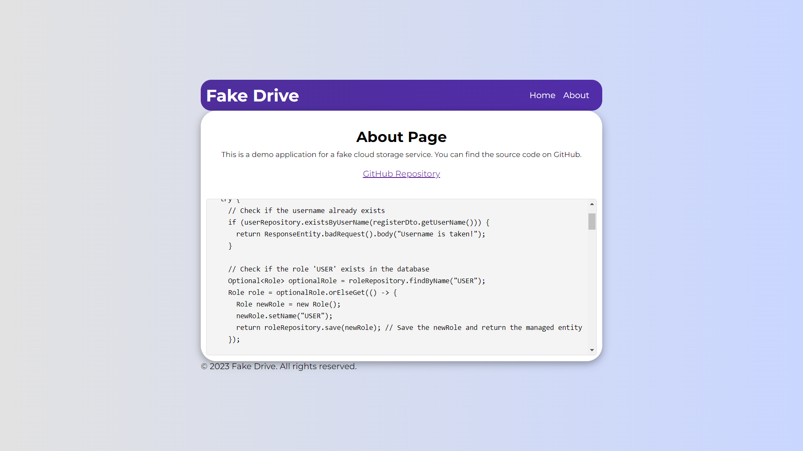

# Introduction to "demo-fakecloud"
The "demo-fakecloud" project is a comprehensive demonstration of a cloud storage application, showcasing both frontend and backend components. Developed with React.js on the frontend and Java for the backend, this project highlights key features such as user authentication, file uploading, and security measures.

## Installation:
1. git clone
```bash
git clone git@github.com:xxxJay123/demo-fakecloud.git
```
2. run backend server:
```bash
cd demo-fakecloud
mvn spring-boot:run
```
3. run React.js:
```bash
cd frontend/demo-fakecloud
npm start
```
4. have fun!~
****
## Development Environment:

### Backend (Spring Boot):
1. Java Version:
    - Java version is set to 17 in the <java.version> property.
2. Spring Boot:
    - The project uses Spring Boot with a parent dependency on spring-boot-starter-parent version 3.1.4.
3. Dependencies:  
    - Key dependencies include:
      - spring-boot-starter-web
      - spring-security (version 6.1.4)
      - jedis (version 5.0.1)
      - jakarta.validation-api (version 3.0.2)
      - spring-boot-starter-data-jpa
      - postgresql (version 42.6.0)
      - jjwt-api, jjwt-impl, jjwt-jackson (version 0.11.5)
4. Build:
    - Maven build tool is used.
    - The `spring-boot-maven-plugin` is configured in the build section.

### Frontend  (React.js)

*****
## Frontend Code:



### 1. Overall Structure:
- The frontend is built using React.js, a popular JavaScript library for building user interfaces.
- The code is organized into components, providing a modular and maintainable structure.

### 2. Styling:
- The application uses the Montserrat font from Google Fonts for a clean and modern typography style.
- CSS is used for styling, with a focus on responsive design.
```css
@import url("https://fonts.googleapis.com/css2?family=Montserrat:wght@300;400;500;600;700&display=swap");

* {
  margin: 0;
  padding: 0;
  box-sizing: border-box;
  font-family: "Montserrat", sans-serif;
}
```


### 3. Authentication and Registration:
- The LoginSignup component handles user authentication and registration.
- Social icons (Google, Facebook, GitHub) are included for alternative authentication methods.
- Axios is used for making API requests to the backend for login and registration.

```jsx 
import React, { useState } from "react";
import axios from "axios";
import Cookies from "js-cookie";
import { FaGooglePlusG, FaFacebookF, FaGithub } from "react-icons/fa";
import "./LoginSignup.css";
```

### 4. Drive Component for File Upload:
- The `Drive` component facilitates file uploads to a fake cloud drive.
- Users can select an image file, which is displayed before submission.
- Axios is used to send the file to the backend.
```jsx
import React, { useState, useEffect } from "react";
import axios from "axios";
import Cookies from "js-cookie";
import { MdCloudUpload, MdDelete } from "react-icons/md";
import { AiFillFileImage } from "react-icons/ai";
import "./Drive.css";
```

### 5. Responsive Design:
- The application is designed to be responsive, ensuring a consistent user experience across various devices.

### 6. API Integration:
- Axios is configured to make API requests to the backend.
- The base URLs for authentication (/api/auth/) and file handling (/api/files) are specified.

### 7. Security:
- Token-based authentication is used to secure user access.
- Passwords are encrypted on the backend for enhanced security.

******

## Backend Code:

### 1. User Registration:
The backend, implemented in Java, includes a user registration endpoint. It performs checks for existing usernames, manages user roles, and encrypts passwords before associating users with roles and storing them in the database.

```Java
@PostMapping("/register")
  public ResponseEntity<String> register(@RequestBody RegisterDTO registerDto) {
    try {
      // Check if the username already exists
      if (userRepository.existsByUserName(registerDto.getUserName())) {
        return ResponseEntity.badRequest().body("Username is taken!");
      }

      // Check if the role 'USER' exists in the database
      Optional<Role> optionalRole = roleRepository.findByName("USER");
      Role role = optionalRole.orElseGet(() -> {
        Role newRole = new Role();
        newRole.setName("USER");
        return roleRepository.save(newRole); // Save the newRole and return the managed entity
      });

      // Create a new user with the provided details
      User user = new User();
      user.setUserName(registerDto.getUserName());
      user.setUserPassword(
          passwordEncoder.encode(registerDto.getUserPassword()));
      user.setUserEmail(registerDto.getUserEmail());

      // Associate the user with the role
      user.setRoles(Collections.singletonList(role));

      // Save the user entity, which will also save the associated role
      userRepository.save(user);

      return ResponseEntity.ok("User registered successfully!");
    } catch (Exception e) {
      // Handle specific exceptions if necessary
      return ResponseEntity.status(HttpStatus.INTERNAL_SERVER_ERROR)
          .body("Failed to register user: " + e.getMessage());
    }
  }

```


### 2. User Login:
For user authentication, the backend provides a login endpoint. It validates users based on their username and password, generating a JSON Web Token (JWT) upon successful authentication.

```Java

    @PostMapping("/login")
    public ResponseEntity<AuthResponseDTO> login(@RequestBody LoginDTO loginDto) {

      // Find user by username
      User user = userRepository.findByUserName(loginDto.getUserName());

      if (user == null) {
        return ResponseEntity.status(HttpStatus.UNAUTHORIZED).build();
      }

      // Check if password matches
      if (!passwordEncoder.matches(loginDto.getUserPassword(),
          user.getPassword())) {
        return ResponseEntity.status(HttpStatus.UNAUTHORIZED).build();
      }

      // Authenticate the user
      Authentication authentication = authenticationManager.authenticate(
          new UsernamePasswordAuthenticationToken(loginDto.getUserName(),
              loginDto.getUserPassword()));

      // If authentication successful, generate JWT token
      if (authentication.isAuthenticated()) {

        String token = jwtGenerator.generateToken(authentication);
        log.info("Token: {}", token);
        return ResponseEntity.ok(new AuthResponseDTO(token));
      } else {
        // If authentication fails, return unauthorized response
        return ResponseEntity.status(HttpStatus.UNAUTHORIZED).build();
      }
    }

```


### 3. File Upload via Token:
A file upload endpoint ensures the security of the process by validating user authentication through a token. It handles the upload of files, storing relevant details in the database for future reference.

```Java
@PostMapping("/upload")
public ResponseEntity<String> uploadFile(
@RequestParam("file") MultipartFile file,
@AuthenticationPrincipal CustomUserDetails userDetails) {
try {
if (userDetails == null) {
return ResponseEntity.status(HttpStatus.UNAUTHORIZED)
.body("User not authenticated.");
}
String username = userDetails.getUsername();
User user = userRepository.findByUserName(username);

              Blob data = blobConverter.convertToBlob(file);
              String fileType = file.getContentType();
              String fileName = file.getOriginalFilename();


              if (user == null) {
                  return ResponseEntity.status(HttpStatus.BAD_REQUEST)
                          .body("User not found.");
              }

              storageService.storeFile(file, fileName, fileType, data, user);

              log.info("File saved in DB: {}", fileName);
              return ResponseEntity.ok("File uploaded successfully: " + fileName);
          } catch (Exception e) {
              return ResponseEntity.status(HttpStatus.INTERNAL_SERVER_ERROR)
                      .body("Failed to upload the file: " + e.getMessage());
          }
      }
```


